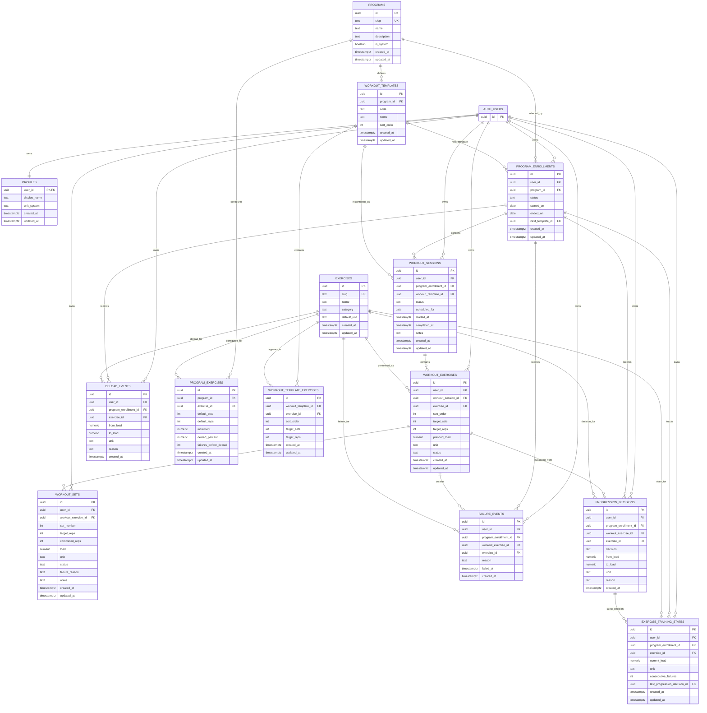

# Database ER Diagram

This diagram shows the proposed Supabase/Postgres storage model. Unlike the domain ER diagram, this one is table-oriented and includes user ownership, reference data, current state, historical workout facts, and explainable training events.

## Storage Notes

- `AUTH_USERS` represents Supabase `auth.users`; app data should reference it but not duplicate authentication state.
- `PROGRAMS`, `EXERCISES`, workout templates, and program exercise rules are reference/configuration data.
- `PROGRAM_ENROLLMENTS` connects a user to a program and anchors their training history.
- `EXERCISE_TRAINING_STATES` is the current mutable state for next load and consecutive failures.
- `WORKOUT_SESSIONS`, `WORKOUT_EXERCISES`, and `WORKOUT_SETS` are immutable historical facts once a workout is completed.
- `FAILURE_EVENTS`, `DELOAD_EVENTS`, and `PROGRESSION_DECISIONS` preserve why the app changed or repeated a load.
- User-owned tables should have RLS policies using `auth.uid() = user_id`.
