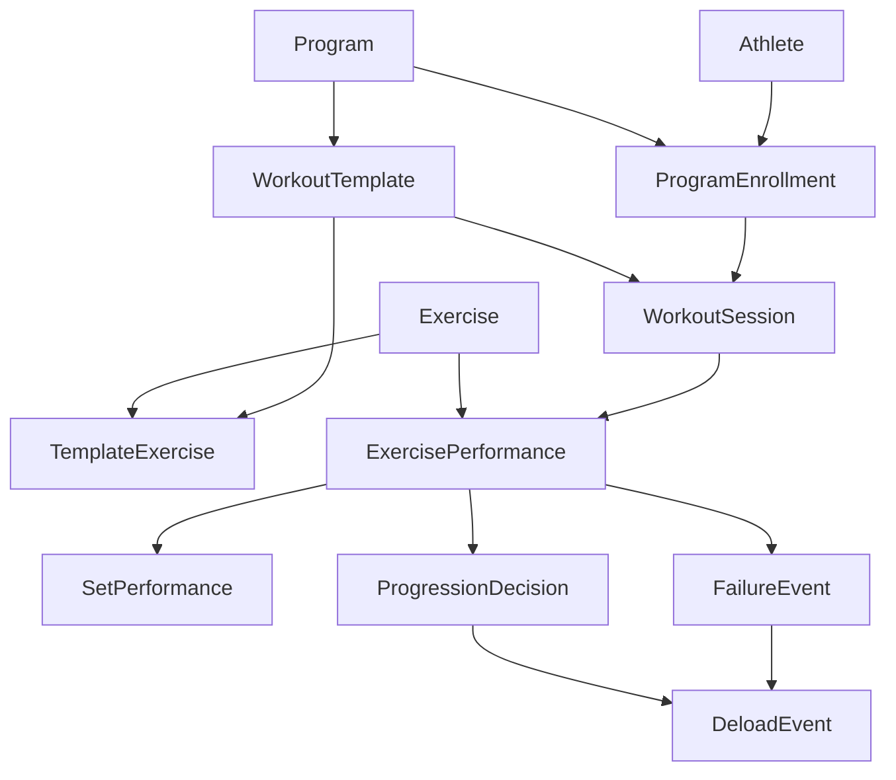

# Domain And Data Model

Project Renascor should keep two related but distinct models:

- The domain model describes how the application thinks: workouts, exercises, sets, progression, failure, deloads, and decisions.
- The database model describes how facts are stored, queried, audited, and protected in Supabase/Postgres.

The two should map cleanly, but they do not need to match one-to-one.

## Domain Model

### Core Concepts

#### Athlete

The signed-in person using the app.

Responsibilities:

- Owns all private training data.
- Has preferences for units, schedule, starting weights, increments, and rest behavior.
- Can have many workout programs over time.

Important distinction:

- The auth user proves identity.
- The athlete profile stores app-specific preferences and training state.

#### Program

A named training method such as StrongLifts 5x5.

Responsibilities:

- Defines the canonical workout templates.
- Defines progression rules.
- Defines failure and deload rules.
- Defines default increments.

Example:

- StrongLifts 5x5 alternates Workout A and Workout B.
- Squat appears in every workout.
- Bench press and overhead press alternate.
- Barbell row and deadlift alternate.

#### Exercise

A movement the athlete performs.

Responsibilities:

- Provides a stable identity for progression.
- Carries defaults such as target sets, target reps, increment, and unit.
- Can be reused across programs and workouts.

Examples:

- Squat
- Bench Press
- Barbell Row
- Overhead Press
- Deadlift

#### Workout Template

A planned workout shape before it is scheduled or performed.

Responsibilities:

- Names the workout pattern.
- Orders the exercises.
- Defines target set and rep prescriptions for each exercise.

Example:

- Workout A: Squat 5x5, Bench Press 5x5, Barbell Row 5x5.
- Workout B: Squat 5x5, Overhead Press 5x5, Deadlift 1x5.

#### Workout Session

A real training event for an athlete.

Responsibilities:

- Represents one performed or planned workout occurrence.
- Has a lifecycle: planned, in progress, paused, completed, skipped, or discarded.
- Contains exercise performances.
- Can produce progression decisions after completion.
- Preserves partially logged results as a resumable draft.

Important distinction:

- A workout template says what should happen.
- A workout session records what actually happened.
- The set is the autosave boundary. A workout is not final until completion, but
  saved set results survive refreshes, browser closes, and navigation.

#### Exercise Performance

An exercise inside a specific workout session.

Responsibilities:

- Records the intended target for that exercise on that day.
- Records the actual outcome across sets.
- Knows whether the exercise was completed successfully.
- Feeds the progression engine.

Example:

- Squat at 72.5 kg, target 5 sets of 5.

#### Set Performance

One performed set.

Responsibilities:

- Records target reps.
- Records completed reps.
- Records load.
- Can record perceived difficulty, notes, or failure reason.

Important distinction:

- The set is the atomic training result.
- The exercise performance summarizes multiple sets.

#### Progression

The rule-based decision about what load should come next.

Responsibilities:

- Determines whether the next workout should increase, repeat, or deload an exercise.
- Uses recent performance history, not just the latest set.
- Produces an explainable decision.

Examples:

- Completed all prescribed reps: increase by the configured increment.
- Failed the same exercise across repeated sessions: deload by the configured percentage.
- Partial failure: repeat the same load.

#### Failure

A meaningful missed target.

Responsibilities:

- Captures that the athlete did not complete the intended prescription.
- Tracks failure count toward a deload.
- Can include reason: missed reps, form breakdown, pain, time, equipment, or skipped.

Important distinction:

- A failed set is raw evidence.
- A failure event is the domain interpretation that affects progression.

#### Deload

A planned reduction in load after repeated failure or manual choice.

Responsibilities:

- Lowers the working weight by a rule-defined amount.
- Resets failure counters for the exercise.
- Records why the deload happened.

Examples:

- Automatic deload after three failed attempts.
- Manual deload because the athlete chooses to reduce load.

### Domain Relationships



### Domain Invariants

- A completed workout session should have at least one exercise performance.
- A completed exercise performance should have the expected number of set performances, unless it was skipped or abandoned.
- Progression decisions are derived from completed exercise performances.
- Failure counters are exercise-specific for a given athlete and program enrollment.
- Deloads are explicit events, not silent edits to the next working weight.
- Historical set loads should never be changed by later progression decisions.

## Database Model

The storage model should favor durable facts, auditability, and Supabase row-level security.

All athlete-owned tables should include:

- `id uuid primary key default gen_random_uuid()`
- `user_id uuid not null references auth.users(id) on delete cascade`
- `created_at timestamptz not null default now()`
- `updated_at timestamptz not null default now()`

Enable RLS on every table in the exposed `public` schema. Policies should use both authentication and ownership, for example:

```sql
using ((select auth.uid()) = user_id)
with check ((select auth.uid()) = user_id)
```

### Tables

#### `profiles`

Stores app-specific athlete preferences.

Columns:

- `user_id uuid primary key references auth.users(id) on delete cascade`
- `display_name text`
- `unit_system text not null default 'metric'`
- `created_at timestamptz not null default now()`
- `updated_at timestamptz not null default now()`

Notes:

- This table is separate from Supabase Auth.
- Do not use user-editable auth metadata for authorization.

#### `programs`

Stores program definitions.

Columns:

- `id uuid primary key default gen_random_uuid()`
- `slug text not null unique`
- `name text not null`
- `description text`
- `is_system boolean not null default false`
- `created_at timestamptz not null default now()`
- `updated_at timestamptz not null default now()`

Notes:

- System programs can be read by all authenticated users.
- Custom programs, if added later, should include `user_id`.

#### `exercises`

Stores reusable exercise definitions.

Columns:

- `id uuid primary key default gen_random_uuid()`
- `slug text not null unique`
- `name text not null`
- `category text`
- `default_unit text not null default 'kg'`
- `created_at timestamptz not null default now()`
- `updated_at timestamptz not null default now()`

Notes:

- Exercises are reference data.
- Athlete-specific progression state should not live here.

#### `program_exercises`

Stores program-specific exercise settings.

Columns:

- `id uuid primary key default gen_random_uuid()`
- `program_id uuid not null references programs(id) on delete cascade`
- `exercise_id uuid not null references exercises(id) on delete restrict`
- `default_sets integer not null`
- `default_reps integer not null`
- `increment numeric(6, 2) not null`
- `deload_percent numeric(5, 2) not null default 10.00`
- `failures_before_deload integer not null default 3`
- `created_at timestamptz not null default now()`
- `updated_at timestamptz not null default now()`

Constraints:

- Unique `(program_id, exercise_id)`.
- `default_sets > 0`.
- `default_reps > 0`.
- `increment > 0`.
- `deload_percent >= 0 and deload_percent <= 100`.

#### `workout_templates`

Stores the reusable pattern for a workout.

Columns:

- `id uuid primary key default gen_random_uuid()`
- `program_id uuid not null references programs(id) on delete cascade`
- `code text not null`
- `name text not null`
- `sort_order integer not null`
- `created_at timestamptz not null default now()`
- `updated_at timestamptz not null default now()`

Constraints:

- Unique `(program_id, code)`.
- Unique `(program_id, sort_order)`.

#### `workout_template_exercises`

Stores ordered exercises inside a workout template.

Columns:

- `id uuid primary key default gen_random_uuid()`
- `workout_template_id uuid not null references workout_templates(id) on delete cascade`
- `exercise_id uuid not null references exercises(id) on delete restrict`
- `sort_order integer not null`
- `target_sets integer not null`
- `target_reps integer not null`
- `created_at timestamptz not null default now()`
- `updated_at timestamptz not null default now()`

Constraints:

- Unique `(workout_template_id, sort_order)`.
- Unique `(workout_template_id, exercise_id)`.
- `target_sets > 0`.
- `target_reps > 0`.

#### `program_enrollments`

Stores an athlete's active relationship to a program.

Columns:

- `id uuid primary key default gen_random_uuid()`
- `user_id uuid not null references auth.users(id) on delete cascade`
- `program_id uuid not null references programs(id) on delete restrict`
- `status text not null default 'active'`
- `started_on date not null default current_date`
- `ended_on date`
- `next_template_id uuid references workout_templates(id) on delete set null`
- `created_at timestamptz not null default now()`
- `updated_at timestamptz not null default now()`

Constraints:

- `status in ('active', 'paused', 'completed', 'archived')`.
- At most one active enrollment per user at a time, enforced with a partial unique index.

#### `exercise_training_states`

Stores the current athlete-specific state for an exercise within an enrollment.

Columns:

- `id uuid primary key default gen_random_uuid()`
- `user_id uuid not null references auth.users(id) on delete cascade`
- `program_enrollment_id uuid not null references program_enrollments(id) on delete cascade`
- `exercise_id uuid not null references exercises(id) on delete restrict`
- `current_load numeric(6, 2) not null`
- `unit text not null default 'kg'`
- `consecutive_failures integer not null default 0`
- `last_progression_decision_id uuid`
- `created_at timestamptz not null default now()`
- `updated_at timestamptz not null default now()`

Constraints:

- Unique `(program_enrollment_id, exercise_id)`.
- `current_load >= 0`.
- `consecutive_failures >= 0`.

Notes:

- This table is a cache of current state.
- The durable history remains workout sessions, set performances, failures, deloads, and progression decisions.

#### `workout_sessions`

Stores planned and performed workouts.

Columns:

- `id uuid primary key default gen_random_uuid()`
- `user_id uuid not null references auth.users(id) on delete cascade`
- `program_enrollment_id uuid not null references program_enrollments(id) on delete cascade`
- `workout_template_id uuid references workout_templates(id) on delete set null`
- `status text not null default 'planned'`
- `scheduled_for date`
- `started_at timestamptz`
- `completed_at timestamptz`
- `paused_at timestamptz`
- `rest_started_at timestamptz`
- `target_rest_seconds integer`
- `rest_set_id uuid references workout_sets(id) on delete set null`
- `notes text`
- `created_at timestamptz not null default now()`
- `updated_at timestamptz not null default now()`

Constraints:

- `status in ('planned', 'in_progress', 'paused', 'completed', 'skipped', 'discarded')`.
- `completed_at is not null` when `status = 'completed'`.
- `target_rest_seconds > 0` when present.

Notes:

- V1 does not include offline-first sync. The durable guarantee begins once the
  server action for a set result succeeds.
- Rest countdowns should be derived from `rest_started_at` plus
  `target_rest_seconds`, not from an in-memory timer.

#### `workout_exercises`

Stores an exercise planned or performed inside a workout session.

Columns:

- `id uuid primary key default gen_random_uuid()`
- `user_id uuid not null references auth.users(id) on delete cascade`
- `workout_session_id uuid not null references workout_sessions(id) on delete cascade`
- `exercise_id uuid not null references exercises(id) on delete restrict`
- `sort_order integer not null`
- `target_sets integer not null`
- `target_reps integer not null`
- `planned_load numeric(6, 2) not null`
- `unit text not null default 'kg'`
- `status text not null default 'planned'`
- `created_at timestamptz not null default now()`
- `updated_at timestamptz not null default now()`

Constraints:

- Unique `(workout_session_id, sort_order)`.
- `status in ('planned', 'active', 'completed', 'failed', 'skipped')`.

Notes:

- `planned_load` is copied from current training state when the workout is created.
- This preserves history even if current state changes later.

#### `workout_sets`

Stores the atomic set results.

Columns:

- `id uuid primary key default gen_random_uuid()`
- `user_id uuid not null references auth.users(id) on delete cascade`
- `workout_exercise_id uuid not null references workout_exercises(id) on delete cascade`
- `set_number integer not null`
- `target_reps integer not null`
- `completed_reps integer not null default 0`
- `load numeric(6, 2) not null`
- `unit text not null default 'kg'`
- `status text not null default 'planned'`
- `failure_reason text`
- `notes text`
- `created_at timestamptz not null default now()`
- `updated_at timestamptz not null default now()`

Constraints:

- Unique `(workout_exercise_id, set_number)`.
- `set_number > 0`.
- `target_reps > 0`.
- `completed_reps >= 0`.
- `status in ('planned', 'completed', 'failed', 'skipped')`.

#### `failure_events`

Stores domain-level failures derived from set or exercise results.

Columns:

- `id uuid primary key default gen_random_uuid()`
- `user_id uuid not null references auth.users(id) on delete cascade`
- `program_enrollment_id uuid not null references program_enrollments(id) on delete cascade`
- `workout_exercise_id uuid not null references workout_exercises(id) on delete cascade`
- `exercise_id uuid not null references exercises(id) on delete restrict`
- `reason text not null`
- `failed_at timestamptz not null default now()`
- `created_at timestamptz not null default now()`

Notes:

- This is not a duplicate of failed sets.
- It is the domain event used by progression.

#### `deload_events`

Stores explicit deload decisions.

Columns:

- `id uuid primary key default gen_random_uuid()`
- `user_id uuid not null references auth.users(id) on delete cascade`
- `program_enrollment_id uuid not null references program_enrollments(id) on delete cascade`
- `exercise_id uuid not null references exercises(id) on delete restrict`
- `from_load numeric(6, 2) not null`
- `to_load numeric(6, 2) not null`
- `unit text not null default 'kg'`
- `reason text not null`
- `created_at timestamptz not null default now()`

Constraints:

- `from_load >= 0`.
- `to_load >= 0`.

#### `progression_decisions`

Stores the result of applying progression rules.

Columns:

- `id uuid primary key default gen_random_uuid()`
- `user_id uuid not null references auth.users(id) on delete cascade`
- `program_enrollment_id uuid not null references program_enrollments(id) on delete cascade`
- `workout_exercise_id uuid not null references workout_exercises(id) on delete cascade`
- `exercise_id uuid not null references exercises(id) on delete restrict`
- `decision text not null`
- `from_load numeric(6, 2) not null`
- `to_load numeric(6, 2) not null`
- `unit text not null default 'kg'`
- `reason text not null`
- `created_at timestamptz not null default now()`

Constraints:

- `decision in ('increase', 'repeat', 'deload', 'hold')`.
- `from_load >= 0`.
- `to_load >= 0`.

Notes:

- This table makes progression explainable.
- The current state table can point to the latest decision.

## Intentional Mismatches

The domain and database models should differ in these places:

- Domain `Athlete` maps to Supabase Auth plus `profiles`.
- Domain `Workout Session` maps to `workout_sessions`, `workout_exercises`, and `workout_sets`.
- Domain `Exercise Performance` maps mostly to `workout_exercises`, with set detail in `workout_sets`.
- Domain `Progression` is a service/rules concept, stored as `progression_decisions`.
- Domain `Failure` is derived from performance but stored as explicit `failure_events`.
- Domain `Deload` is an event and decision, not just a changed number in `exercise_training_states`.

## Suggested TypeScript Domain Shape

```ts
type WorkoutStatus =
  | "planned"
  | "in_progress"
  | "paused"
  | "completed"
  | "skipped"
  | "discarded";
type SetStatus = "planned" | "completed" | "failed" | "skipped";
type ProgressionDecisionKind = "increase" | "repeat" | "deload" | "hold";

type Load = {
  value: number;
  unit: "kg" | "lb";
};

type Workout = {
  id: string;
  status: WorkoutStatus;
  templateName: string;
  scheduledFor: string | null;
  exercises: ExercisePerformance[];
};

type ExercisePerformance = {
  id: string;
  exerciseId: string;
  exerciseName: string;
  targetSets: number;
  targetReps: number;
  plannedLoad: Load;
  sets: SetPerformance[];
};

type SetPerformance = {
  id: string;
  setNumber: number;
  targetReps: number;
  completedReps: number;
  load: Load;
  status: SetStatus;
  failureReason?: string;
};

type ProgressionDecision = {
  kind: ProgressionDecisionKind;
  exerciseId: string;
  fromLoad: Load;
  toLoad: Load;
  reason: string;
};
```

## First Migration Scope

The first schema migration should include:

- `profiles`
- `programs`
- `exercises`
- `program_exercises`
- `workout_templates`
- `workout_template_exercises`
- `program_enrollments`
- `exercise_training_states`
- `workout_sessions`
- `workout_exercises`
- `workout_sets`
- `failure_events`
- `deload_events`
- `progression_decisions`
- RLS policies for all user-owned tables
- Seed data for the StrongLifts 5x5 program, exercises, templates, and default rules

The first application domain module should include:

- Entities and value objects for workouts, exercises, sets, loads, and decisions.
- A progression service that accepts recent exercise history and returns a `ProgressionDecision`.
- Mapping functions from database rows to domain objects.
