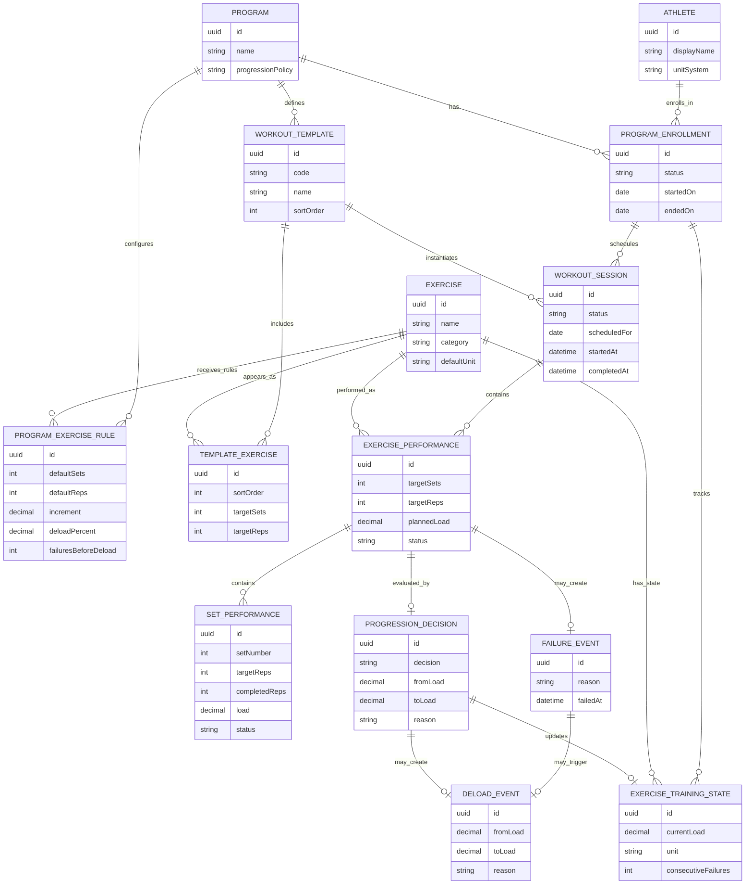

# Domain ER Diagram

This diagram shows the domain model relationships. It is intentionally more conceptual than the database schema: domain entities describe how the app thinks, not necessarily how rows are stored.

## Reading Notes

- `ExerciseTrainingState` is current state, while workout/session/set entities are history.
- `ProgressionDecision`, `FailureEvent`, and `DeloadEvent` are explicit domain events so the app can explain why a weight changed.
- `WorkoutTemplate` describes the intended pattern; `WorkoutSession` records an actual occurrence.
- `ExercisePerformance` summarizes a movement inside a workout; `SetPerformance` records the atomic result.
