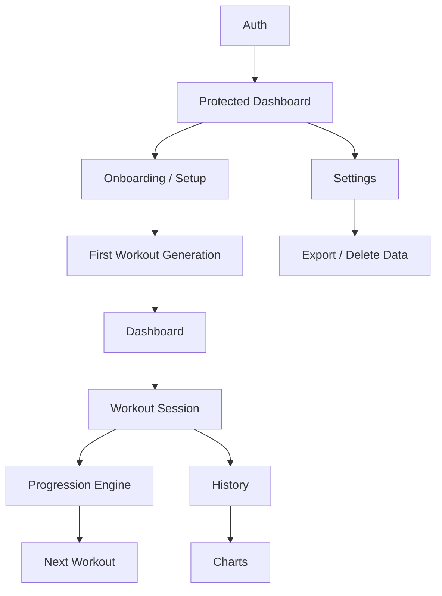

# Feature Map

This document defines the V1 product surface for Project Renascor and how the
features connect across screens, data, permissions, and server actions.

## V1 Feature List

| Area | V1 features |
| --- | --- |
| Auth | Signup, login, logout, protected dashboard, email confirmation redirect |
| Onboarding / Setup | Unit preference, starting weights, rest timer preference, first workout generation |
| Dashboard | Current workout, next workout, recent history, progress summary |
| Workout Session | Start workout, log sets, failed set handling, rest timer, pause/resume, complete/discard workout |
| Progression Engine | Increase, repeat, deload, explain next weight |
| History | Completed workouts, set-level detail, delete session |
| Charts | Weight progression by exercise, workout frequency |
| Settings | Profile, units, training preferences, data export, training-data delete, account/data delete |

## Deferred Feature List

| Area | Deferred features |
| --- | --- |
| Auth | Social login, password reset polish, device/session management, MFA |
| Onboarding / Setup | Custom programs, schedule selection, warmup preferences, plate availability, import from other apps |
| Dashboard | Calendar agenda, readiness prompts, streaks, richer recommendations |
| Workout Session | Offline queueing, form videos, warmup set builder, superset support, live coaching cues |
| Progression Engine | Program variants, custom progression rules, manual overrides with audit trail |
| History | Edit completed session, restore deleted session, notes search, CSV import |
| Charts | Volume, estimated 1RM, personal records, deload markers, exercise comparisons |
| Settings | Subscription/billing, notification preferences, connected devices, privacy controls |

## Screen / Page Map

| Screen | Route | Purpose | Primary features |
| --- | --- | --- | --- |
| Home | `/` | Public entry point | Product intro, links to signup/login/dashboard |
| Signup | `/signup` | Create account | Signup |
| Login | `/login` | Start session | Login |
| Auth confirm | `/auth/confirm` | Supabase email callback | Confirm email and establish session |
| Dashboard | `/dashboard` | Protected app hub | Current workout, next workout, history summary, charts summary, settings/data ownership entry points |
| Workout session | `/workouts/[id]` or dashboard panel | Log active workout | Set logging, timer, pause/resume, complete/discard |
| History | `/history` or dashboard tab | Review completed sessions | Completed workouts, detail, delete session |
| Charts | `/charts` or dashboard tab | Visualize training | Progression and frequency charts |
| Settings | `/settings` or dashboard panel | Manage account/preferences/data | Profile, units, training preferences, export/delete |
| Health check | `/api/health` | Deployment verification | Supabase configuration and DB reachability |

V1 can ship the dashboard, workout session, history, charts, and settings as
separate routes or as dashboard tabs. If they remain inside `/dashboard`, the
navigation labels should still match the logical structure below.

## Navigation Structure

Public navigation:

- Home
- Signup
- Login

Authenticated navigation:

- Dashboard
- Workout
- History
- Charts
- Settings
- Logout

Default authenticated flow:

1. User lands on `/dashboard`.
2. If onboarding is incomplete, show setup before the rest of the dashboard.
3. If an open workout exists, make it the primary action.
4. If no open workout exists, show the next workout preview and a start action.
5. Secondary navigation exposes history, charts, settings, and logout.

## User Roles / Permissions

| Role | Permissions |
| --- | --- |
| Visitor | View public home, open signup/login, submit auth forms |
| Authenticated athlete | Read and write only their own profile, enrollment, workout, set, progression, failure, deload, and settings data |
| System/admin service | Delete Supabase Auth users for account deletion using `SUPABASE_SERVICE_ROLE_KEY`; never exposed to client code |

Permission rules:

- All athlete-owned tables require Supabase Auth and row-level security scoped by `user_id`.
- Reference data such as programs, exercises, templates, and program rules is readable by authenticated users.
- Server actions must get the user from the authenticated Supabase server client and rely on RLS for ownership checks.
- Client components should never receive service-role credentials or direct cross-user identifiers.

## Feature Dependencies

Core ordering:

- Auth gates every private feature.
- Onboarding must create a profile, active program enrollment, exercise training states, and first workout or next-workout preview.
- Workout completion depends on durable set logging.
- Progression decisions depend on completed workout exercise outcomes.
- Dashboard, history, and charts depend on workout session data.
- Settings and data ownership depend on authenticated user identity and RLS.

## Feature Requirements

### 1. Auth

Scope:

- Signup
- Login
- Logout
- Protected dashboard

Required data:

- Supabase Auth user
- `profiles.user_id`
- Email, password, confirmation callback state

Server actions / APIs:

- `signUp(formData)`
- `logIn(formData)`
- `logOut()`
- `/auth/confirm`
- Supabase server client session/claims checks

States:

- Empty: blank email/password fields with clear labels.
- Loading: submit button disabled or pending while auth request runs.
- Error: missing credentials, invalid login, existing email, unconfirmed email, expired callback.
- Success: signup redirects to login with confirmation message; login redirects to dashboard; logout redirects to login.

Acceptance criteria:

- A visitor can create an account with valid email/password.
- Auth errors are visible and do not expose sensitive internal details.
- A confirmed user can log in and reach `/dashboard`.
- An unauthenticated visitor attempting `/dashboard` is redirected to `/login`.
- Logout clears the session and prevents access to protected pages.

### 2. Onboarding / Setup

Scope:

- Unit preference
- Starting weights
- Rest timer preference
- First workout generation

Required data:

- `profiles.unit_system`
- `profiles.display_name`
- Active `program_enrollments` row
- `exercise_training_states.current_load`
- StrongLifts reference data from `programs`, `exercises`, `workout_templates`, `workout_template_exercises`, and `program_exercises`
- Rest preference stored in profile or future training preferences table

Server actions / APIs:

- `updateUserSettings(input)`
- `createWorkout(input)`
- `calculateNextWorkout()`
- Future dedicated action: `completeOnboarding(input)`

States:

- Empty: no profile or active enrollment; show setup flow.
- Loading: saving preferences, creating training state, generating first workout.
- Error: missing starting weights, invalid unit, missing seed data, failed enrollment creation.
- Success: profile/enrollment/training states exist and dashboard shows first or next workout.

Acceptance criteria:

- New authenticated users are prompted to choose units before normal dashboard use.
- User can set starting loads for each V1 exercise.
- Starting loads are saved as exercise-specific training state.
- Rest timer preference is saved and used by the workout session.
- First workout uses the first StrongLifts template and the saved starting weights.

### 3. Dashboard

Scope:

- Current workout
- Next workout
- Recent history
- Progress summary

Required data:

- Authenticated user
- Open `workout_sessions` with exercises and sets
- Active `program_enrollments.next_template_id`
- `exercise_training_states`
- Recent `workout_sessions`
- Chart/progress data derived from completed workouts

Server actions / APIs:

- `fetchOpenWorkout()`
- `calculateNextWorkout()`
- `createWorkout(input)`
- `fetchHistory(limit)`
- `fetchChartData()`

States:

- Empty: no workouts yet; show setup/start first workout action.
- Loading: dashboard sections can load independently.
- Error: unable to fetch open workout, next workout, history, or chart summary.
- Success: user sees current workout if present; otherwise next workout is primary.

Acceptance criteria:

- Dashboard is protected by server-side auth.
- Current workout appears before next workout when an open session exists.
- Next workout displays template name, exercises, target sets/reps, planned loads, and units.
- Recent history shows latest sessions with status and date.
- Progress summary reflects completed workout data and gracefully handles no data.

### 4. Workout Session

Scope:

- Start workout
- Log sets
- Failed set handling
- Rest timer
- Pause/resume
- Complete/discard workout

Required data:

- `workout_sessions`
- `workout_exercises`
- `workout_sets`
- `exercise_training_states`
- `profiles` or preferences for units/rest defaults

Server actions / APIs:

- `createWorkout(input)`
- `startWorkoutSession(workoutId)`
- `fetchOpenWorkout()`
- `updateSetResult(input)`
- `startRestTimer(input)`
- `clearRestTimer(workoutId)`
- `pauseWorkoutSession(workoutId)`
- `discardWorkoutSession(workoutId)`
- `completeWorkout(workoutId)`

States:

- Empty: no active workout; show start next workout.
- Loading: start, set save, timer update, pause/resume, complete/discard operations.
- Error: set save failure, stale/deleted workout, incomplete sets on completion, RLS denial.
- Success: set results autosave; timer survives refresh; workout can resume after navigation.

Acceptance criteria:

- Starting a workout materializes exercises and planned sets from the selected template.
- Each set can be marked completed, failed, or skipped with completed reps.
- Failed sets can store a reason or note.
- Rest timer is derived from server timestamps and survives refresh.
- Pausing clears active rest state and allows resume.
- Completion is blocked until every set is completed, failed, or skipped.
- Completing a workout applies progression and advances the next template.
- Discarding a workout removes it from active flow without applying progression.

### 5. Progression Engine

Scope:

- Increase
- Repeat
- Deload
- Explain next weight

Required data:

- `workout_sets`
- `workout_exercises`
- `program_exercises.increment`
- `program_exercises.deload_percent`
- `program_exercises.failures_before_deload`
- `exercise_training_states.current_load`
- `exercise_training_states.consecutive_failures`
- `progression_decisions`
- `failure_events`
- `deload_events`

Server actions / APIs:

- `completeWorkout(workoutId)`
- `applyProgression(workoutExerciseId)`
- `applyDeload(input)`
- `calculateNextWorkout()`
- Domain service: `calculateProgressionDecision(input)`

States:

- Empty: no completed sets; no decision shown.
- Loading: progression is being applied at workout completion.
- Error: missing rule, missing training state, duplicate decision failure, invalid deload input.
- Success: decision persisted with from/to load and explanation.

Acceptance criteria:

- Completing all prescribed reps increases next load by configured increment.
- Failing but below the deload threshold repeats the current load.
- Reaching the configured failure threshold creates a deload decision and event.
- Manual deload lowers current load, resets consecutive failures, and records an event.
- Every progression decision includes a human-readable reason.
- Historical set loads remain unchanged after progression.

### 6. History

Scope:

- Completed workouts
- Set-level detail
- Delete session
- Future: edit session

Required data:

- `workout_sessions`
- `workout_exercises`
- `workout_sets`
- Related progression, failure, and deload events

Server actions / APIs:

- `fetchHistory(limit)`
- `deleteWorkoutSession(workoutId)`
- Future: `updateCompletedWorkout(input)`

States:

- Empty: no completed workouts; show start workout call to action.
- Loading: fetching or deleting sessions.
- Error: unable to load history, delete failed, session not found.
- Success: sessions display with exercises, set details, status, completed date, and delete control.

Acceptance criteria:

- History lists completed workouts newest first.
- Each workout can expand or navigate to set-level details.
- Deleting a session removes dependent exercises, sets, progression decisions, failure events, and automatic deload events through cascades.
- Deleted sessions no longer appear in dashboard history or chart data.
- Editing completed sessions is visibly deferred and not implied by V1 controls.

### 7. Charts

Scope:

- Weight progression by exercise
- Workout frequency
- Future: volume, estimated 1RM

Required data:

- Completed `workout_sessions.completed_at`
- `workout_exercises.planned_load`
- Exercise names from `exercises`
- Set completion data from `workout_sets`

Server actions / APIs:

- `fetchChartData()`
- Derived frequency query or future `fetchWorkoutFrequency()`

States:

- Empty: no completed workouts; explain that charts appear after completion.
- Loading: chart skeletons or section-level loading.
- Error: chart data unavailable.
- Success: charts render by exercise and date with readable units.

Acceptance criteria:

- Weight progression chart groups points by exercise.
- Chart points use completed workout dates and historical planned loads.
- Workout frequency shows workouts per week or recent calendar period.
- Charts exclude discarded and in-progress workouts.
- Empty data state does not look broken.

### 8. Settings

Scope:

- Profile
- Units
- Training preferences
- Data export/delete

Required data:

- `profiles`
- Auth user email/id
- Active enrollment and training state for preferences that affect workouts
- All user-owned training tables for export/delete
- Reference data needed to interpret exported workouts

Server actions / APIs:

- `updateUserSettings(input)`
- `exportMyData()`
- `deleteAllTrainingData()`
- `deleteAccountAndAppData()`
- `deleteWorkoutSession(workoutId)` where surfaced from data ownership UI

States:

- Empty: no profile row; create/update profile on first save.
- Loading: saving preferences, exporting data, deleting data/account.
- Error: invalid display name/unit, export failure, missing service role for account deletion.
- Success: settings persist; export downloads or displays JSON; delete operations remove scoped data and refresh UI.

Acceptance criteria:

- User can update display name and unit system.
- Unit changes are reflected in future workout displays and setup defaults.
- Training preferences can be saved without corrupting existing history.
- Data export contains user profile, training data, and reference data.
- Training-data deletion keeps the auth account but removes program enrollment and dependent training rows.
- Account deletion removes app data and Supabase Auth user using server-only credentials.

## Cross-Feature Acceptance Criteria

- All private features require an authenticated user.
- User-owned reads and writes are scoped to the current user by RLS and server-side auth checks.
- Server actions return `ActionResult<T>` style success/error results where UI flows need recoverable errors.
- Navigation never strands the user: every empty state offers the next useful action.
- Loading and error states are section-level where possible so one failed panel does not hide the entire dashboard.
- Workout history is durable at the set level before final workout completion.
- Progression is explainable and auditable through stored decision/event rows.
